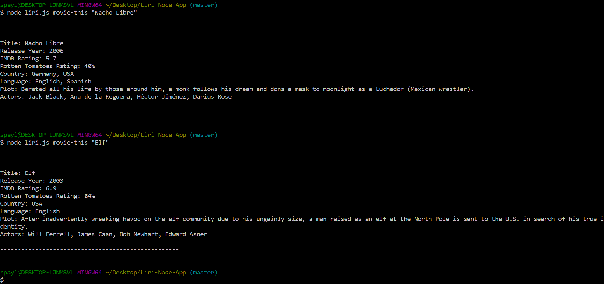

# Liri-Node-App
University of Utah - Trilogy BootCamp Homework #8

## Liri

Liri is not Siri but it is a node.js command line application that takes in parameters and gives back data. The user must enter 'node liri.js' into the command line followed by a command and then a search parameter.

There are four possible Commands:

## 'concert-this'
The 'concert-this' command uses the Bandsintown API to retrive all upcoming concerts for an artist that is searched.  Each venue na,e location and date is provided for all rsults.  Moment.js is used to format the dtae from the Bandsintown API.  

Example: node liri.js

User types in the following: 'node liri.js
Possible commands are: 'concert-this', 'spotify-this-song', 'movie-this', or 'do-what-it-says'. The search parameter can be whatever the user is looking for. 
Example: 

'concert-this' uses the Bandsintown API to retrieve all upcoming concerts for an artist that is searched. Each venue name, location, and date is provided for all results. Moment.js is used to format the date from the Bandsintown API.

'spotify-this-song' uses the Spotify API to retrieve data about the song entered in the search parameter. All song titles that contain the search parameter or parts of it are returned. The user will receive the artist, song name, a link to preview the song, and the album name for each result.

'movie-this' uses the OMDb API to retreive data about the movie entered in the search parameter. The result will include the title, release year, IMDb rating, Rotten Tomatoes rating, country or countries it was filmed in, langauge(s), plot, and actors/actresses in the film.

'do-what-it-says' is a command that reads the random.txt file and executes the parameters inside of it. By default it is set to 'spotify-this-song,I Want It That Way', but this can be changed to any of the other commands with any search parameter. 
Example: movie-this,Pulp Fiction

All results are returned in the command line, but also into a separate text file named 'log.txt' as well.

Technologies used: Javascript, Node.js, Moment.js, Bandsintown API, Spotify API, OMDb API