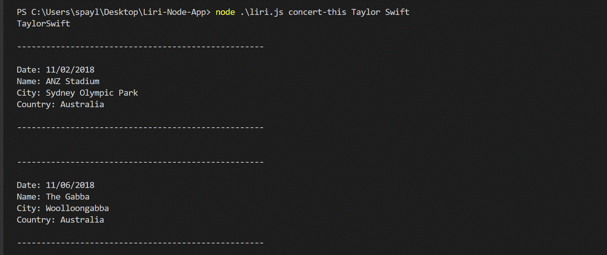
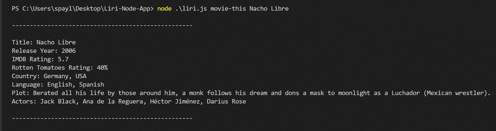

# Liri-Node-App
University of Utah - Trilogy BootCamp Homework #8

## Liri

Liri is not as cool as Siri but it is a node.js command line application that takes in parameters and gives back data. The user must enter 'node liri.js' into the command line followed by a command and then a search parameter.

There are four possible Commands: 'concert-this', 'spotify-this-song', 'movie-this', or 'do-what-it-says'

## 'concert-this'

🎤👨‍🎤👩‍🎤🎸 The 'concert-this' command uses the Bandsintown API to retrive all upcoming concerts for an artist that is searched.  Each venue, location and date is provided for all results.  Moment.js is used to format the date from the Bandsintown API.  

In the following example the user is looking for the next Taylor Swift Concert:
node liri.js concert-this "Taylor Swift"

## 'spotify-this-song'

🎵🎹🎼🎧 The 'spotify-this-song' command uses the Spotify API to retrieve data about the song entered in the search parameter. All song titles that contain the search parameter or parts of it are returned. The user will receive the artist, song name, a link to preview the song, and the album name for each result.

In this example the user is looking for the Song "Beauty and the Beast"
node liri.js spotify-this-song "Beauty and the Beast"

## 'movie-this'

🎥🎞️🎬🍅 The 'movie-this' command uses the OMDb API to retreive data about the movie entered in the search parameter. The result will include the title, release year, IMDb rating, Rotten Tomatoes rating, country or countries it was filmed in, langauge(s), plot, and actors/actresses in the film.

In this example the user is looking for information about the movie "Nacho Libre"
node liri.js movie-this "Nacho Libre

## 'do-what-it-says'

The 'do-what-it-says' command reads the random.txt file and executes the parameters inside of it. By default it is set to 'spotify-this-song, I Want It That Way', but this can easily be changed to any of the other commands with any search parameter. 

All results are returned in the command line, but also into a separate text file named 'log.txt' as well.

Technologies used: Javascript, Node.js, Moment.js, Bandsintown API, Spotify API, OMDb API

Video Demonstration:
